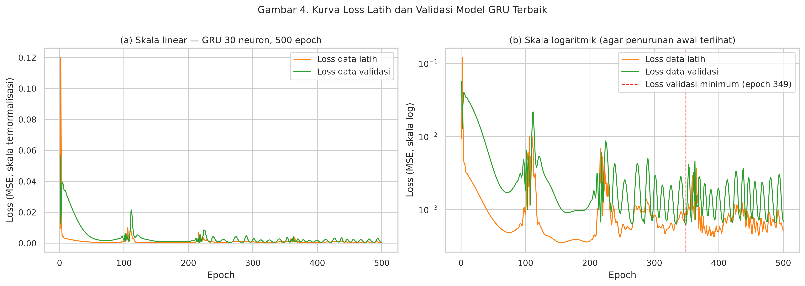

# Perhitungan Manual - Tahap 8.10: Membaca Kurva Loss Model GRU

Simulasi pada [Tahap 8.2 (Simulasi Pelatihan GRU, Langkah 1-2: Forward Pass dan Loss)](tahap_08_02_simulasi_forward_pass_dan_loss_gru.md) sampai [Tahap 8.4 (Simulasi Pelatihan GRU, Langkah 4: Update Adam)](tahap_08_04_simulasi_update_adam_gru.md) memperlihatkan
satu siklus pelatihan pada model mini. Subbagian ini membaca hasil siklus yang sama pada
**model GRU penelitian yang sebenarnya** (30 neuron, 500 epoch),
yaitu kurva loss latih dan loss validasi.

**Daftar isi**

- [1. Apa yang Digambar Kurva Loss](#1-apa-yang-digambar-kurva-loss)
- [2. Kurva Loss Model GRU Terbaik](#2-kurva-loss-model-gru-terbaik)
- [3. Cara Membacanya](#3-cara-membacanya)
- [4. Mengapa Jumlah Epoch Dipilih Lewat Data Validasi](#4-mengapa-jumlah-epoch-dipilih-lewat-data-validasi)
- [5. Hubungan MSE dengan RMSE dalam USD](#5-hubungan-mse-dengan-rmse-dalam-usd)
- [6. Ringkasan: Kapan Loss dan Adam Bekerja](#6-ringkasan-kapan-loss-dan-adam-bekerja)

**Cara membaca angka.** Angka memakai titik sebagai pemisah desimal dan koma
sebagai pemisah ribuan, sama seperti berkas perhitungan manual lainnya. Angka
ditampilkan 6 desimal, tetapi dihitung dengan presisi penuh, sehingga selisih
pembulatan pada digit ke-6 bisa muncul saat Anda menjumlahkan angka yang tampil.
Nomor persamaan dan gambar mengacu pada draf skripsi (subbab 1.5.7 sampai 1.5.11).

## 1. Apa yang Digambar Kurva Loss

Di akhir setiap epoch, Keras mencatat dua angka:

- **loss latih**: rata-rata MSE dari 26 batch selama epoch itu
  (25 batch × 32 sampel + 1 batch × 4 sampel);
- **loss validasi**: MSE pada 90 sampel validasi memakai bobot akhir epoch.
  Angka ini **hanya diukur; tidak ada update bobot** dari data validasi.

Keduanya dihitung pada skala ternormalisasi (persamaan 28). Selama 500 epoch,
Adam melakukan 26 × 500 = **13,000
kali update**.

## 2. Kurva Loss Model GRU Terbaik



| Besaran | Nilai |
|---|---|
| Loss latih epoch 1 | 0.00930230 |
| Loss latih epoch terakhir (500) | 0.00051683 |
| Penurunan loss latih | 94.4% |
| Loss validasi epoch 1 | 0.05659199 |
| Loss validasi epoch terakhir (500) | 0.00068225 |
| Loss validasi minimum | 0.00061486 (epoch 349) |

## 3. Cara Membacanya

- Jika **loss latih dan loss validasi turun bersama**, model sedang mempelajari pola yang
  benar.
- Jika **loss latih terus turun tetapi loss validasi naik**, itu tanda *overfitting*: model
  mulai menghafal data latih.
- Pada model ini, loss latih turun 94.4% dari epoch pertama. Loss validasi mencapai
  minimum lebih awal, di epoch 349, lalu naik sedikit sampai epoch terakhir (0.00061486 menjadi 0.00068225).

## 4. Mengapa Jumlah Epoch Dipilih Lewat Data Validasi

RMSE validasi model 30 neuron untuk setiap jumlah epoch pada grid (tabel tuning GRU):

| Epoch | RMSE validasi (USD) |
|---|---|
| 100 | 4,157.69 |
| 500 | 2,564.89 ← terbaik |
| 1,000 | 4,602.29 |

Pada neuron ini, melatih sampai 1,000 epoch justru memperburuk RMSE validasi dibandingkan 500 epoch. Pelatihan yang lebih lama tidak selalu lebih baik; kemungkinan besar model mulai terlalu menyesuaikan diri dengan data latih. Itulah gunanya data validasi untuk memilih jumlah epoch, sedangkan data uji tetap netral.

## 5. Hubungan MSE dengan RMSE dalam USD

Karena normalisasi min-max bersifat linear (persamaan 6 dan 8), selisih dalam USD sama
dengan selisih ternormalisasi dikali (x_max − x_min). Akibatnya:

**RMSE (USD) = (x_max − x_min) × √MSE**

Dengan rentang harga data latih 123,359.45 − 25,162.70 = 98,196.75:

```
RMSE = 98,196.75 × √0.00068225
     = 98,196.75 × 0.026120
     = 2,564.89 USD
RMSE validasi pada tabel tuning = 2,564.89 USD
```

Jadi **meminimalkan MSE saat pelatihan sama artinya dengan meminimalkan RMSE dalam USD**.
Kalimat ini berguna untuk menjawab pertanyaan "mengapa loss-nya MSE tetapi evaluasinya
RMSE?".

## 6. Ringkasan: Kapan Loss dan Adam Bekerja

| Tahap penelitian | Loss MSE | Adam |
|---|---|---|
| Inisialisasi model | - | m = 0, v = 0, k = 0 |
| Setiap batch latih (26× per epoch) | dihitung, menjadi sumber gradien | memperbarui semua bobot dan bias |
| Akhir setiap epoch | loss latih dan loss validasi dicatat (kurva loss) | tidak ada update dari data validasi |
| Pemilihan neuron dan epoch terbaik | tidak (memakai RMSE validasi USD, setara √MSE × rentang) | tidak |
| Prediksi data uji dan evaluasi | tidak | tidak (bobot sudah beku) |

<!-- navigasi-perhitungan-manual -->

---

← Sebelumnya: [Tahap 8.8: Jumlah Parameter Model GRU](tahap_08_08_jumlah_parameter_gru.md)

[Daftar isi perhitungan manual](README.md)

→ Berikutnya: [Tahap 8.11: Forward Pass GRU (Jendela Pertama Data Uji)](tahap_08_11_forward_pass_gru.md)
