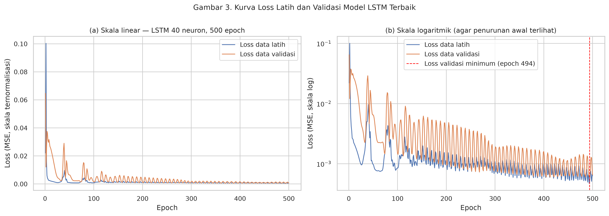

# Perhitungan Manual - Tahap 7 & 8 (Bagian 2 dari 4): Fungsi Loss dan Adam

> Berkas ini dibuat otomatis oleh `tools/simulasi_pelatihan_manual.py`. Semua
> angka dihitung ulang oleh skrip itu dan diperiksa dengan `assert`. Untuk membuat
> ulang seluruh seri: `python tools/simulasi_pelatihan_manual.py`.

**Seri perhitungan manual pelatihan LSTM dan GRU** (baca berurutan):

1. [Alur Sel LSTM dan GRU (Gambar 1-7)](tahap_7_8_1_alur_sel_lstm_gru.md)
2. **Fungsi Loss dan Adam** ← sedang dibaca
3. [Simulasi Satu Siklus Pelatihan LSTM dan GRU](tahap_7_8_3_simulasi_pelatihan_lstm_gru.md)
4. [Bias pada LSTM dan GRU](tahap_7_8_4_bias_lstm_gru.md)

[Bagian 1](tahap_7_8_1_alur_sel_lstm_gru.md) menjelaskan apa yang terjadi di dalam sel saat prediksi dibuat
(*forward pass*). Pada contoh model mini, prediksinya ŷ′ = 0.174235
padahal targetnya 0.7. Bagian ini menjelaskan **bagaimana model belajar dari
kesalahan itu**: fungsi loss mengukur kesalahan, gradien menunjukkan arah perbaikan,
dan Adam menggeser bobot. Perhitungan lengkapnya untuk satu siklus ada di [Bagian 3](tahap_7_8_3_simulasi_pelatihan_lstm_gru.md).

**Daftar isi**

- [1. Gambaran Besar: Loss, Gradien, dan Adam](#1-gambaran-besar-loss-gradien-dan-adam)
- [2. Kapan Dipakai: Alur Pelatihan di Penelitian](#2-kapan-dipakai-alur-pelatihan-di-penelitian)
- [3. Fungsi Loss: Mean Squared Error](#3-fungsi-loss-mean-squared-error)
- [4. Membaca Kurva Loss](#4-membaca-kurva-loss)
- [5. Hubungan MSE dengan RMSE dalam USD](#5-hubungan-mse-dengan-rmse-dalam-usd)
- [6. Adam: Alur Satu Kali Update](#6-adam-alur-satu-kali-update)
- [7. Contoh Angka Adam: 1 Parameter, 2 Iterasi](#7-contoh-angka-adam-1-parameter-2-iterasi)
- [8. Koreksi Bias Seiring Iterasi](#8-koreksi-bias-seiring-iterasi)
- [9. Mengapa Adam Cocok untuk Penelitian Ini](#9-mengapa-adam-cocok-untuk-penelitian-ini)
- [10. Ringkasan: Kapan Loss dan Adam Bekerja](#10-ringkasan-kapan-loss-dan-adam-bekerja)
- [11. Catatan untuk Naskah Skripsi](#11-catatan-untuk-naskah-skripsi)

**Cara membaca angka.** Seperti berkas perhitungan manual lainnya, angka memakai
titik sebagai pemisah desimal dan koma sebagai pemisah ribuan. Angka ditampilkan
6 desimal, tetapi skrip menghitung dengan presisi penuh, sehingga selisih
pembulatan pada digit ke-6 bisa muncul saat Anda menjumlahkan angka yang tampil.
Nomor persamaan dan gambar mengacu pada draf skripsi (subbab 1.5.7 sampai 1.5.11).

## 1. Gambaran Besar: Loss, Gradien, dan Adam

Pelatihan model bisa dibayangkan seperti **orang yang menuruni gunung dalam kabut**
untuk mencari titik terendah:

| Komponen | Analogi | Tugasnya |
|---|---|---|
| **Fungsi loss (MSE)** | ketinggian posisi saat ini | mengukur **seberapa salah** prediksi; makin kecil makin baik |
| **Gradien gₖ** | kemiringan tanah di bawah kaki | menunjukkan **arah** perubahan bobot yang menaikkan loss; dihitung dengan *backpropagation through time* (BPTT) |
| **Adam** | strategi melangkah | memutuskan **seberapa jauh dan ke mana** setiap bobot digeser agar loss turun |

Urutannya selalu: **loss dihitung → gradien dihitung dari loss → Adam memakai
gradien untuk memperbarui bobot**. Adam tidak menghitung gradien sendiri; ia hanya
memakai gradien yang sudah ada.

## 2. Kapan Dipakai: Alur Pelatihan di Penelitian

Di penelitian, data latih berisi **804 sampel** (jendela 7 hari ×
10 fitur) dengan **batch size 32**. Jadi satu epoch terdiri dari
⌈804 / 32⌉ = **26 batch**:
25 batch berisi 32 sampel dan 1 batch terakhir berisi
4 sampel. Untuk **setiap kombinasi neuron × epoch** pada grid
(misalnya LSTM 40 neuron, 500 epoch):

**Langkah 0 — persiapan model.**

- Bobot diisi acak (Glorot uniform untuk W, ortogonal untuk U); bias = 0 kecuali
  bias forget LSTM = 1 ([Bagian 4](tahap_7_8_4_bias_lstm_gru.md)).
- Memori Adam di-nol-kan: m₀ = 0, v₀ = 0, penghitung k = 0.

**Langkah 1-5 — diulang untuk setiap batch**, berurutan secara kronologis karena
`shuffle=False`:

1. **Forward pass.** 32 jendela masuk ke LSTM/GRU lalu dense, menghasilkan
   32 prediksi ŷ′ (alur [Bagian 1](tahap_7_8_1_alur_sel_lstm_gru.md)).
2. **Hitung loss.** MSE dari 32 prediksi itu terhadap nilai aktual y′
   (subbagian 3).
3. **Hitung gradien.** BPTT menghasilkan gₖ untuk **setiap parameter**
   (8,201 parameter pada LSTM-40,
   3,811 pada GRU-30).
4. **Update Adam.** Setiap parameter digeser memakai persamaan (29)-(31) (subbagian 6).
5. k bertambah 1, lalu lanjut ke batch berikutnya.

**Langkah 6 — akhir setiap epoch.**

- Keras mencatat **loss latih**, yaitu rata-rata loss dari 26 batch
  selama epoch itu.
- Keras menghitung **loss validasi** pada 90 sampel validasi memakai bobot
  akhir epoch. Ini **hanya diukur; tidak ada update bobot**.
- Kedua angka inilah yang digambar sebagai **kurva loss** (subbagian 4).

**Langkah 7 — setelah semua epoch selesai.**

- Bobot pada **epoch terakhir** yang dipakai (penelitian tidak memakai *early stopping*).
- Prediksi data validasi didenormalisasi ke USD, lalu **RMSE validasi** dipakai untuk
  memilih kombinasi neuron × epoch terbaik: LSTM 40 neuron
  500 epoch dan GRU 30 neuron
  500 epoch.

**Jumlah update Adam per model** (26 per epoch):

| Epoch | Jumlah update |
|---|---|
| 100 | 26 × 100 = 2,600 |
| 500 | 26 × 500 = 13,000 |
| 1,000 | 26 × 1,000 = 26,000 |

**Kapan loss dan Adam TIDAK dipakai:**

- saat **memilih model terbaik** (dipakai RMSE validasi dalam USD);
- saat **memprediksi data uji** (hanya forward pass, bobot sudah beku);
- saat **evaluasi akhir** (RMSE, MAE, MAPE, akurasi arah dalam USD) dan **uji
  Diebold-Mariano**.

Singkatnya, **loss dan Adam hanya bekerja di fase pelatihan**.

## 3. Fungsi Loss: Mean Squared Error

Persamaan (28):

$$\mathcal{L} = \frac{1}{N}\sum_{k=1}^{N}\left(y'_k - \hat{y}'_k\right)^2$$

**Cara kerjanya**, dengan contoh 3 sampel:

| Sampel | Aktual y′ | Prediksi ŷ′ | Selisih | Kuadrat |
|---|---|---|---|---|
| 1 | 0.50 | 0.48 | 0.02 | 0.0004 |
| 2 | 0.52 | 0.53 | -0.01 | 0.0001 |
| 3 | 0.55 | 0.51 | 0.04 | 0.0016 |

```
MSE = (0.0004 + 0.0001 + 0.0016) / 3 = 0.0021 / 3 = 0.0007
```

**Mengapa dikuadratkan?**

1. Selisih positif dan negatif tidak saling meniadakan.
2. Kesalahan besar dihukum jauh lebih berat: selisih 0.04 menyumbang
   16 kali lebih besar daripada selisih 0.01, sehingga
   model "dipaksa" menghindari meleset jauh.
3. Fungsi kuadrat **mulus dan bisa diturunkan di semua titik**. Turunannya,
   ∂L/∂ŷ′ = −2(y′ − ŷ′), menjadi titik awal BPTT ([Bagian 3](tahap_7_8_3_simulasi_pelatihan_lstm_gru.md), subbagian 3.4). MAE
   (nilai mutlak) tidak mulus di titik nol.

**Mengapa dihitung pada skala ternormalisasi, bukan USD?** Harga Bitcoin bernilai
puluhan ribu USD. Selisih 2,500.00 USD jika dikuadratkan menjadi
6,250,000.00, sehingga gradien sangat besar dan pelatihan tidak stabil. Pada
skala 0-1 selisih yang sama hanya 0.025459 dan kuadratnya 0.000648.

**Nilai N dalam praktik:**

- saat pelatihan, N = 32 (ukuran batch; batch terakhir N = 4);
- loss validasi dihitung pada N = 90 sampel validasi;
- pada model mini di [Bagian 3](tahap_7_8_3_simulasi_pelatihan_lstm_gru.md), N = 1, sehingga
  L = (0.7 − 0.174235)² = 0.276429.

## 4. Membaca Kurva Loss

Kurva loss memperlihatkan loss latih dan loss validasi di akhir setiap epoch
(langkah 6 pada subbagian 2). Berikut kurva model terbaik dari notebook:




| Besaran | LSTM (40 neuron, 500 epoch) | GRU (30 neuron, 500 epoch) |
|---|---|---|
| Loss latih epoch 1 | 0.02209279 | 0.00930230 |
| Loss latih epoch terakhir | 0.00063068 | 0.00051683 |
| Penurunan loss latih | 97.1% | 94.4% |
| Loss validasi epoch 1 | 0.06462061 | 0.05659199 |
| Loss validasi epoch terakhir | 0.00065024 | 0.00068225 |
| Loss validasi minimum | 0.00059231 (epoch 494) | 0.00061486 (epoch 349) |

**Cara membacanya:**

- Jika **loss latih dan loss validasi turun bersama**, model sedang mempelajari pola
  yang benar. Itu terlihat pada kedua model di awal pelatihan.
- Jika **loss latih terus turun tetapi loss validasi naik**, itu tanda *overfitting*:
  model mulai menghafal data latih.
- Loss validasi LSTM mencapai minimum di epoch 494, sangat dekat dengan
  epoch terakhir. Loss validasi GRU mencapai minimum lebih awal, di epoch
  349, lalu sedikit naik sampai epoch terakhir.

**Mengapa jumlah epoch dipilih lewat data validasi?** RMSE validasi pada neuron terbaik
untuk setiap jumlah epoch (Tabel 9 dan Tabel 11):

| Epoch | LSTM 40 neuron (USD) | GRU 30 neuron (USD) |
|---|---|---|
| 100 | 3,804.03 | 4,157.69 |
| 500 | 2,503.99 ← terbaik | 2,564.89 ← terbaik |
| 1,000 | 2,718.20 | 4,602.29 |

Pada neuron terbaik, melatih sampai 1,000 epoch justru memperburuk RMSE
validasi dibandingkan 500 epoch. Pelatihan yang lebih lama tidak
selalu lebih baik; kemungkinan besar model mulai terlalu menyesuaikan diri dengan data
latih. Itulah gunanya data validasi untuk memilih jumlah epoch.

## 5. Hubungan MSE dengan RMSE dalam USD

Karena normalisasi min-max bersifat linear (persamaan 6 dan 8), selisih dalam USD
sama dengan selisih ternormalisasi dikali (x_max − x_min). Akibatnya:

**RMSE (USD) = (x_max − x_min) × √MSE**

Dengan rentang harga data latih 123,359.45 − 25,162.70 = 98,196.75
dan loss validasi epoch terakhir dari notebook:

| Model | Loss validasi (MSE) | Rentang × √MSE | RMSE validasi di tabel tuning |
|---|---|---|---|
| LSTM | 0.00065024 | 98,196.75 × 0.025500 = 2,504.00 USD | 2,503.99 USD |
| GRU | 0.00068225 | 98,196.75 × 0.026120 = 2,564.89 USD | 2,564.89 USD |

Jadi **meminimalkan MSE saat pelatihan sama artinya dengan meminimalkan RMSE dalam
USD** (selisih kecil hanya karena loss validasi dicetak 8 desimal). Kalimat ini
berguna untuk menjawab pertanyaan "mengapa loss-nya MSE tetapi evaluasinya RMSE?".

## 6. Adam: Alur Satu Kali Update

Adam dijalankan **untuk setiap parameter secara terpisah**. Setiap bobot dan bias
punya m dan v miliknya sendiri, sehingga setiap parameter punya "kecepatan belajar"
sendiri. Satu kali update terdiri dari empat langkah:

**Langkah A — momen pertama (persamaan 29, kiri)**

$$m_k = \beta_1\, m_{k-1} + (1-\beta_1)\, g_k \qquad (\beta_1 = 0.9)$$

Isinya adalah **rata-rata bergerak dari arah gradien**, kira-kira merangkum ±10
gradien terakhir karena 1/(1 − 0.9) = 10. Fungsinya seperti **momentum bola yang
menggelinding**: gradien dari satu batch bisa "berisik", dan dengan dirata-rata, arah
langkah menjadi lebih stabil.

**Langkah B — momen kedua (persamaan 29, kanan)**

$$v_k = \beta_2\, v_{k-1} + (1-\beta_2)\, g_k^2 \qquad (\beta_2 = 0.999)$$

Isinya adalah **rata-rata bergerak dari besarnya gradien (dikuadratkan)**, kira-kira
merangkum ±1,000 gradien terakhir. Fungsinya **mengukur seberapa besar atau
bergejolak gradien parameter itu**; nilainya dipakai sebagai pembagi di langkah D.

**Langkah C — koreksi bias (persamaan 30)**

$$\hat{m}_k = \frac{m_k}{1-\beta_1^k} \qquad \hat{v}_k = \frac{v_k}{1-\beta_2^k}$$

m dan v dimulai dari **nol**, sehingga di awal pelatihan nilainya "tertarik" ke nol.
Pembagi (1 − βᵏ) mengoreksinya, dan pengaruhnya hilang setelah banyak iterasi
(subbagian 8).

**Langkah D — update parameter (persamaan 31)**

$$\theta_k = \theta_{k-1} - \eta\,\frac{\hat{m}_k}{\sqrt{\hat{v}_k}+\epsilon}
\qquad (\eta = 0.001,\ \epsilon = 10^{-7})$$

- Pembilang m̂ₖ menentukan **arah** langkah.
- Pembagi √v̂ₖ menyesuaikan **ukuran langkah**: parameter yang gradiennya besar atau
  bergejolak mendapat langkah lebih kecil, sedangkan yang gradiennya kecil mendapat
  langkah relatif lebih besar.
- Tanda minus berarti bergerak **berlawanan** arah gradien, yaitu menuruni loss.
- η = 0.001 adalah batas kasar ukuran langkah. Rasio m̂/√v̂ biasanya sekitar ±1, jadi
  setiap parameter bergeser paling jauh sekitar ±0.001 per iterasi.
- ε hanya pengaman agar tidak terjadi pembagian dengan nol.

Penerapan keempat langkah ini pada 14 parameter model mini ada di [Bagian 3](tahap_7_8_3_simulasi_pelatihan_lstm_gru.md), subbagian 3.10 sampai 3.12.

## 7. Contoh Angka Adam: 1 Parameter, 2 Iterasi

Misalkan satu bobot bernilai awal θ₀ = 0.5, dengan gradien iterasi 1 g₁ = 0.2 dan iterasi 2 g₂ = 0.1:

| Tahap | Iterasi 1 (g = 0.2) | Iterasi 2 (g = 0.1) |
|---|---|---|
| m = 0.9 m_lama + 0.1 g | 0.9 × 0 + 0.1 × 0.2 = 0.020000 | 0.9 × 0.020000 + 0.1 × 0.1 = 0.028000 |
| v = 0.999 v_lama + 0.001 g² | 0.001 × 0.2² = 0.00004000 | 0.999 × 0.00004000 + 0.001 × 0.1² = 0.00004996 |
| m̂ = m / (1 − 0.9ᵏ) | 0.020000 / 0.1 = 0.200000 | 0.028000 / 0.19 = 0.147368 |
| v̂ = v / (1 − 0.999ᵏ) | 0.00004000 / 0.001 = 0.040000 | 0.00004996 / 0.001999 = 0.024992 |
| √v̂ | 0.200000 | 0.158090 |
| Langkah η × m̂ / (√v̂ + ε) | 0.001 × 0.200000 / 0.200000 = 0.0010000 | 0.001 × 0.147368 / 0.158090 = 0.0009322 |
| θ baru = θ lama − langkah | 0.5 − 0.0010000 = 0.499000 | 0.499000 − 0.0009322 = 0.498068 |

**Bukti "tidak dipengaruhi penskalaan gradien".** Jika gradiennya **100 kali lebih
besar** (g₁ = 20, g₂ = 10), langkahnya tetap
**0.0010000 dan 0.0009322**, sama persis. Rasio m̂/√v̂
menghapus skala gradien. Sebagai pembanding, SGD biasa (langkah = η × g) akan melangkah
100 kali lebih jauh.

## 8. Koreksi Bias Seiring Iterasi

Pembagi koreksi bias makin lama makin mendekati 1, sehingga pengaruhnya hilang.
Koreksi m hanya penting di epoch pertama, sedangkan koreksi v masih berpengaruh
sampai puluhan epoch (angka epoch memakai 26 iterasi per epoch penelitian):

| Iterasi k | Keterangan | 1 − 0.9ᵏ (pembagi m) | 1 − 0.999ᵏ (pembagi v) |
|---|---|---|---|
| 1 | iterasi pertama | 0.100000 | 0.001000 |
| 2 | iterasi kedua | 0.190000 | 0.001999 |
| 26 | akhir epoch 1 | 0.935389 | 0.025678 |
| 1,000 | ± epoch 38 | 1.000000 | 0.632305 |
| 2,600 | akhir epoch 100 | 1.000000 | 0.925823 |
| 13,000 | akhir epoch 500 | 1.000000 | 0.999998 |

## 9. Mengapa Adam Cocok untuk Penelitian Ini

- Adam menggabungkan dua ide: **momentum** (dari m) dan **langkah adaptif per
  parameter** (dari v, ide RMSProp/AdaGrad; Kingma & Ba, 2015).
- Gradien dari batch data kripto yang fluktuatif cenderung berisik; momentum
  meredamnya.
- Parameter LSTM/GRU sangat beragam (bobot gerbang, bobot kandidat, bias, dense).
  Langkah adaptif membuat semuanya bisa belajar dengan kecepatan wajar tanpa harus
  mengatur learning rate satu per satu. Di [Bagian 3](tahap_7_8_3_simulasi_pelatihan_lstm_gru.md) terlihat gradien terbesar dan
  terkecil berbeda ratusan sampai ribuan kali, tetapi semua parameter tetap bergeser
  ±0.001 pada iterasi pertama.
- Pengaturan Adam **identik** untuk LSTM dan GRU (η = 0.001, β₁ = 0.9, β₂ = 0.999,
  ε = 10⁻⁷, batch 32, seed sama), sehingga perbedaan hasil hanya berasal dari
  arsitektur.

## 10. Ringkasan: Kapan Loss dan Adam Bekerja

| Tahap penelitian | Loss MSE | Adam |
|---|---|---|
| Inisialisasi model | - | m = 0, v = 0, k = 0 |
| Setiap batch latih (26× per epoch) | dihitung, menjadi sumber gradien | memperbarui semua bobot dan bias |
| Akhir setiap epoch | loss latih dan loss validasi dicatat (kurva loss) | tidak ada update dari data validasi |
| Pemilihan neuron dan epoch terbaik | tidak (memakai RMSE validasi USD, setara √MSE × rentang) | tidak |
| Prediksi data uji dan evaluasi | tidak | tidak (bobot sudah beku) |

## 11. Catatan untuk Naskah Skripsi

1. **Keterangan N pada persamaan (28).** Saat pelatihan, loss dihitung per
   *mini-batch*, jadi N = 32 (batch terakhir 4), bukan seluruh
   sampel. Saran kalimat:

   > Saat pelatihan, ℒ dihitung pada setiap mini-batch berukuran N = 32,
   > sedangkan loss yang dilaporkan per epoch merupakan rata-rata loss seluruh
   > mini-batch.

2. **Arti iterasi ke-k pada Adam.** Satu iterasi adalah satu kali update per batch,
   bukan per epoch. Saran kalimat:

   > Satu iterasi k bersesuaian dengan satu mini-batch, sehingga dengan
   > 804 sampel latih dan batch size 32 terdapat
   > 26 iterasi per epoch.

3. **Opsional, hubungan loss dan evaluasi** (subbab 1.5.11 atau 1.5.12):

   > Karena normalisasi min-max bersifat linear, RMSE dalam USD sama dengan
   > (x_max − x_min) × √MSE, sehingga meminimalkan MSE pada skala ternormalisasi
   > setara dengan meminimalkan RMSE dalam USD.

---

← Sebelumnya: [Bagian 1. Alur Sel LSTM dan GRU (Gambar 1-7)](tahap_7_8_1_alur_sel_lstm_gru.md)

→ Berikutnya: [Bagian 3. Simulasi Satu Siklus Pelatihan LSTM dan GRU](tahap_7_8_3_simulasi_pelatihan_lstm_gru.md)
